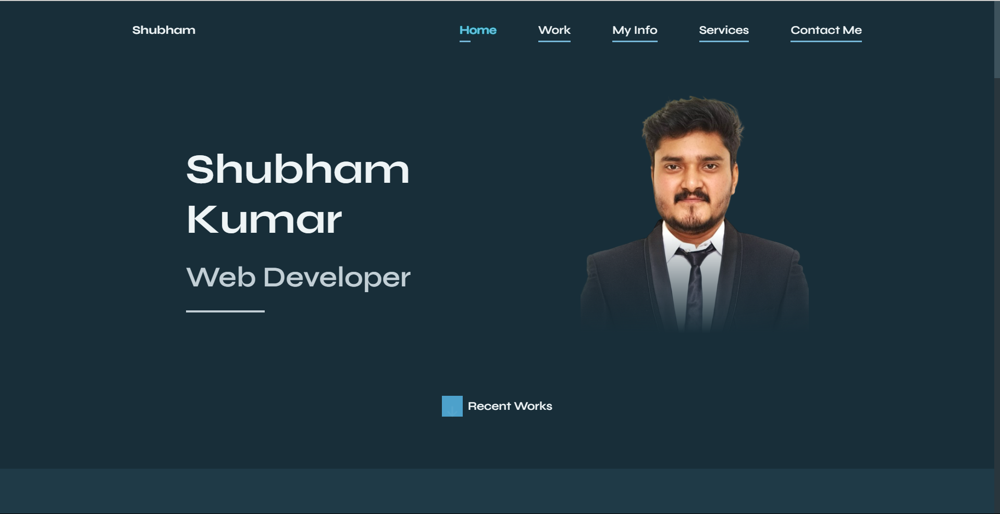
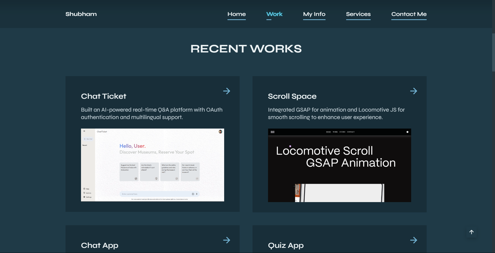
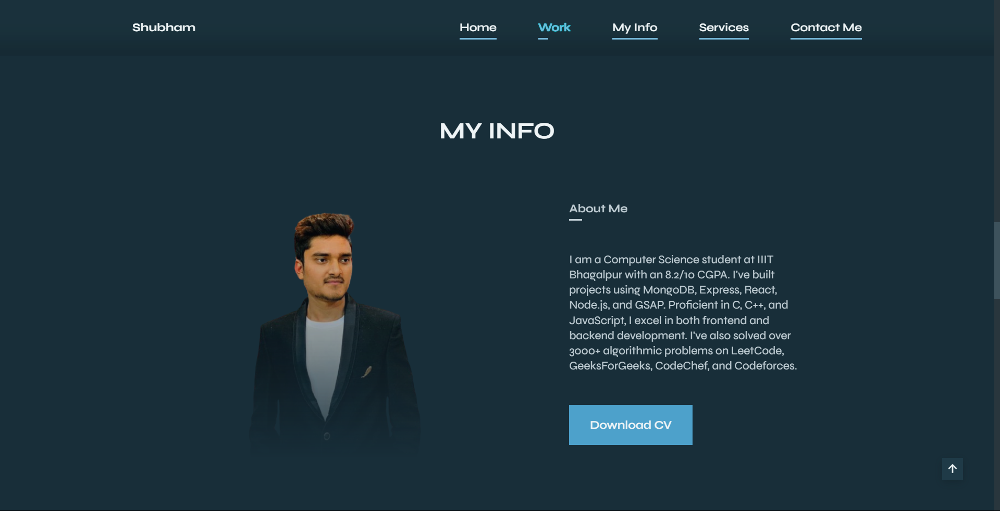
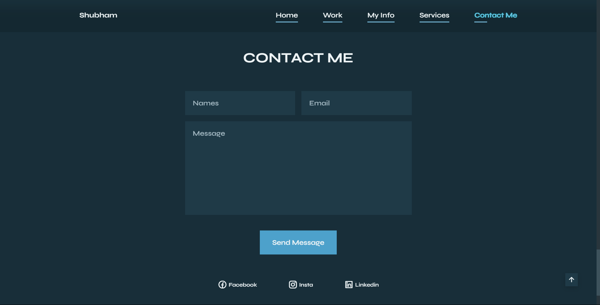

# Responsive Portfolio with Dynamic Theme

A fully responsive HTML and CSS-based portfolio website with a dynamic theme that allows users to change colors. This portfolio showcases personal projects, achievements, resume, and additional details.

[Live Demo](https://shubham-potifolio.netlify.app/)

---

## Overview
This portfolio website is designed to:
- Highlight personal achievements and projects.
- Offer a customizable user experience with dynamic theme switching.
- Provide an elegant and responsive design for all devices.

---

## Features
- **Dynamic Theme Switching:** Users can change the website's color theme as desired.
- **Responsive Design:** Optimized for desktop, tablet, and mobile devices.
- **Comprehensive Showcase:** Includes sections for projects, achievements, resume, and more.
- **Modern Design:** Clean and visually appealing layout.

---

## Screenshots
### Home Page:





---

## Technologies Used

### Frontend
- **HTML5:** Semantic markup for content.
- **CSS3:** Advanced styling and layout.
- **Responsive Design Techniques:** Ensures compatibility across devices.

### Hosting
- Hosted on Netlify: [Live Demo](https://shubham-potifolio.netlify.app/)

---

## Installation

### Steps
1. Clone the repository:
   ```bash
   git clone https://github.com/your-username/portfolio.git
   ```

2. Navigate to the project directory:
   ```bash
   cd portfolio
   ```

3. Open the `index.html` file in your browser:
   ```bash
   open index.html
   ```

---

## How It Works
1. **Dynamic Theme:** JavaScript toggles between different color schemes based on user input.
2. **Responsive Layout:** Media queries ensure a seamless experience on all screen sizes.
3. **Comprehensive Content:** Organized sections provide a clear overview of personal and professional details.

---

## Future Improvements
- Add animations for better user interaction.
- Integrate a backend to fetch dynamic content.
- Include a blog section for additional updates.

---

## Contribution
Contributions are welcome! Feel free to fork the repository and submit a pull request.

---

## Contact
For queries or feedback, please contact [Shubham](mailto:shubhamjaishu@gmail.com).
